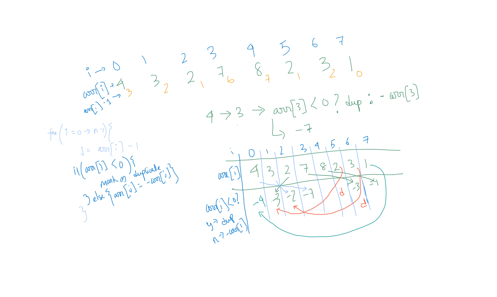
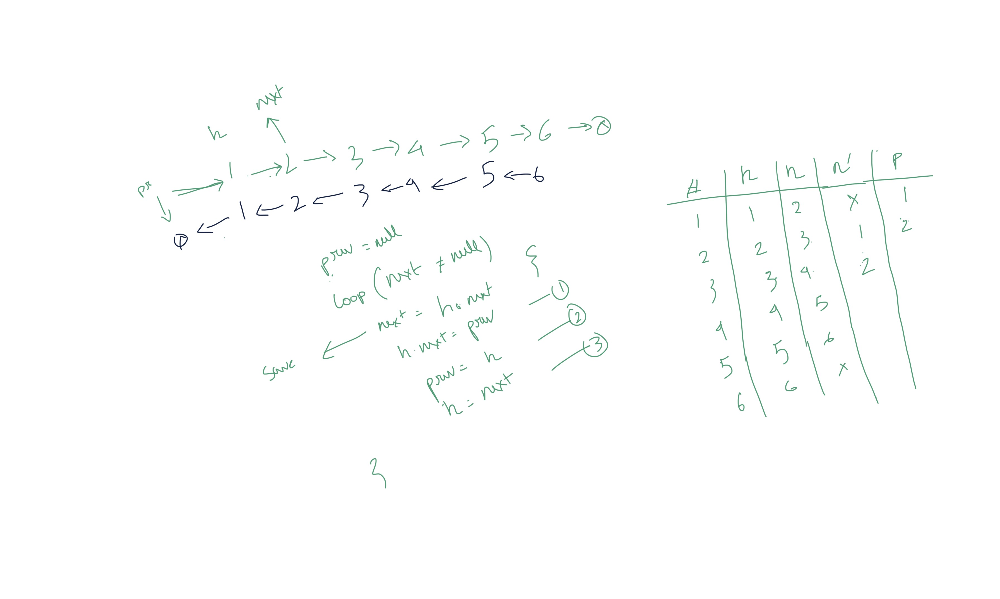
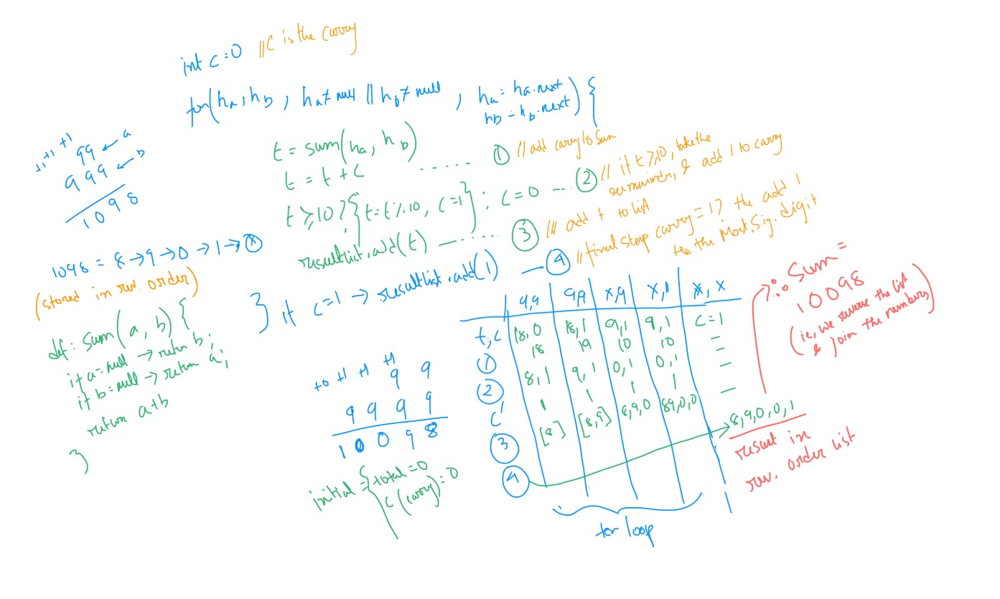

# Commons


- ## Array Duplicates

    Find duplicates in an array of all positive integers. 
    Leetcode link: [https://leetcode.com/problems/find-all-duplicates-in-an-array/](https://leetcode.com/problems/find-all-duplicates-in-an-array/)

    This algorithm works with NO Extra space, and in `O(n)` time. 

    The main logic used here, is that based on the value of the current element, another element's value is multiplied by -1, or, marked as duplicate if already negative.

    Pseudocode:

    ```java
    int arr[n]; // we have an array of length n
    List<Integer> dups; // store duplicates here

    for (i = 0; i < n; i++ ) {
    	int j = arr[i] - 1; // the second element, based on i, which will be used to determine duplicate
    	if ( arr[j] < 0 ) {
    		// if the value at the second element is already negative, then this has been encountered before
    		// thus, this is a duplicate
    		dups.add(arr[i])
    	}else {
    		arr[j] = -arr[j] // negate, indicating encountered
    	}
    }
    ```

    


- ## Reverse Linked List

    Given a singly linked list, here's a simple way to reverse the same.

    - Initially the Linked list will start with an element as `head`, without any `previous` element pointing to it,
    - And the list will end with a last node which has a `null` as the `next` element, indicating the end of the list
    - We now want to have the head have a `next` element of null, basically becoming the new `tail` ,
    - and the earlier `tail` element, which had element point to it, to not be pointed by anyone, and instead point to a `not-null` element

    Pseudocode:

    ```java
    int prev = null;
    int next = list(0);

    for (head = list(0); next != null; head = next) {
    	next = head.next;   // saving the `next` element for next iteration
    	head.next = prev;   // reverse the direction
    	prev = head;        // increment prev, and make it ready for next iteration 
    }

    ```

    


- ## Sum of Integers as Lists

    [https://leetcode.com/problems/add-two-numbers/](https://leetcode.com/problems/add-two-numbers/)

    Numbers are represented as reversed linked list. Thus, 123 is represented as `3 -> 2 -> 1` . You are given two non-empty linked lists representing two non-negative integers. The digits are stored in reverse order and each of their nodes contain a single digit. Add the two numbers and return it as a linked list. You may assume the two numbers do not contain any leading zero, except the number 0 itself.

    **Example:**
    Input: (2 -> 4 -> 3) + (5 -> 6 -> 4),         Output: 7 -> 0 -> 8
    Reason: 342 + 465 = 807

    Pseudocode:

    ```java
    List a = 99;     // 1st number as list
    List b = 1098;   // 2nd number as list
    List result = new List() // result will be saved in this list

    int ha = a(0);   // head of a
    int hb = b(0);   // head of b

    int sum(a, b) {
    	if (a == null) return b;
    	if (b == null) return a;
    	return a + b;
    }

    int c = 0; // carry

    for (ha, hb; ha != null || hb != null; ha = ha.next, hb = hb.next) {
    	
    	// first get the sum of least significant digits
    	int t = sum(ha, hb);
    	
    	// include the carry from previous operation
    	t = t + c;

    	// if the sum is > 9, get the carry and save the reminder as the result of this step
    	if(t >= 10) {
    		t = t % 10;
    		c = 1; // carry will be 0 or 1, as 9 + 9 = 18, thus max carry can be 1
    	} else {
    		c = 0; // reset the carry from what it was in the previous step
    	}
    	
    	result.add(t)
    }

    // this one last step is to account for any left over carry from the last step
    if (c == 1) result.add(1);

    // the inputs are stored in reverse order and thus, processed in reverse order.
    // making it in the correct order
    sout("Answer: ", result.reverse) // hypothetical reverse function

    ```

    